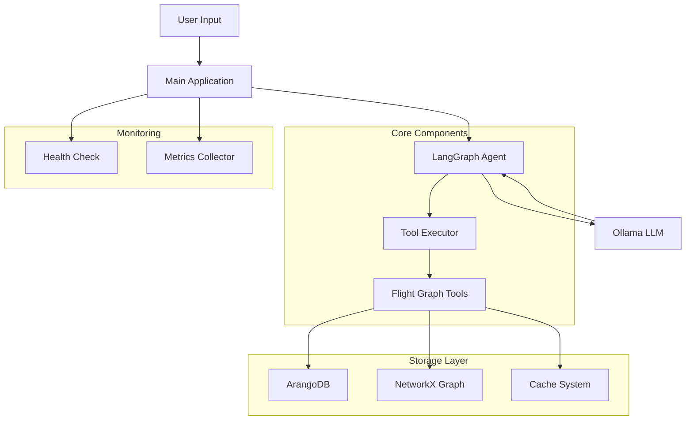
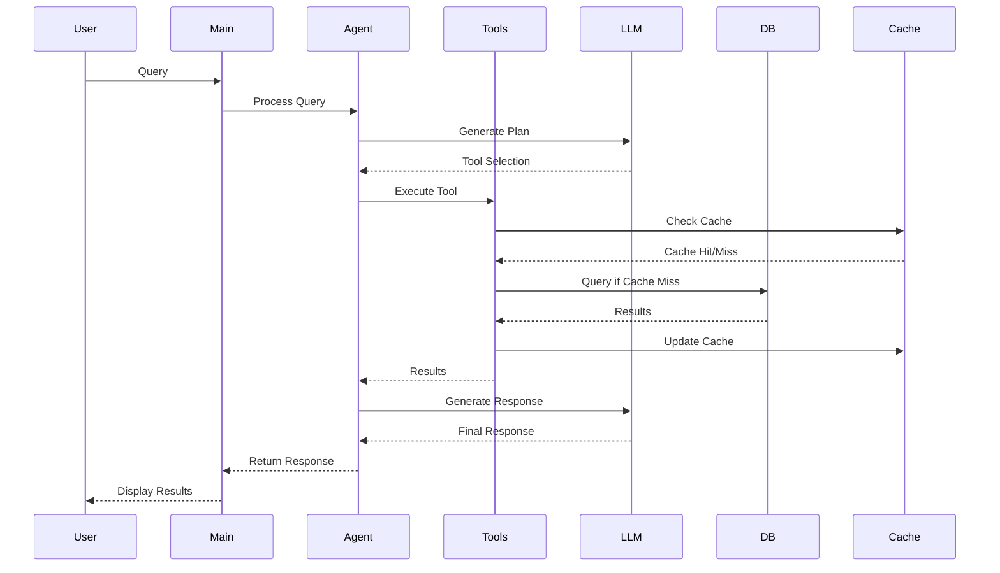

# GraphRAG Agentic Flight Network Analysis System

## 🌟 Project Overview
The GraphRAG Agentic Flight Network Analysis System is an advanced flight network analysis tool that combines graph theory, RAG (Retrieval-Augmented Generation), and agentic AI to provide intelligent insights about global flight networks. This system enables users to analyze flight patterns, discover optimal routes, and understand airport importance in the global aviation network.

## 🏗️ Architecture


## 🔑 Key Features
1. **Intelligent Query Processing**
   - Natural language understanding for flight queries
   - Context-aware responses using LangGraph agents
   - Local LLM integration via Ollama

2. **Advanced Graph Analysis**
   - Direct flight discovery
   - Shortest path calculations
   - Airport importance metrics (PageRank, Betweenness)
   - Multi-stop route optimization

3. **Performance & Reliability**
   - Thread-safe caching system
   - Retry mechanisms for resilience
   - Health monitoring
   - Performance metrics collection

4. **Data Management**
   - ArangoDB integration for graph storage
   - NetworkX for graph computations
   - Efficient data caching
   - IATA code validation

## 🛠️ Technical Stack
- **Backend Framework**: Python
- **Graph Database**: ArangoDB
- **Graph Processing**: NetworkX
- **LLM Integration**: Ollama (llama2)
- **Agent Framework**: LangGraph
- **Data Processing**: Pandas, NumPy
- **Caching**: Custom Thread-safe implementation
- **Monitoring**: Custom metrics and health check system

## 📊 System Components

### 1. Core Classes
- `FlightGraphTools`: Main class for graph operations
- `OllamaWrapper`: LLM integration handler
- `ThreadSafeCache`: Thread-safe caching system
- `MetricsCollector`: System metrics tracking
- `HealthCheck`: System health monitoring

### 2. Key Functions
- Flight path finding
- Airport importance analysis
- Route optimization
- Geospatial queries
- Network statistics

## 🚀 Getting Started

### Prerequisites
- Python 3.8+
- ArangoDB
- Ollama with llama2 model

### Installation
1. Clone the repository:
```bash
git clone https://github.com/twumasij/GraphRAG_Agentic_APP.git
cd GraphRAG_Agentic_APP
```

2. Create and activate a virtual environment:
```bash
python -m venv venv
source venv/bin/activate  # On Windows: venv\Scripts\activate
```

3. Install dependencies:
```bash
pip install -r requirements.txt
```

4. Set up environment variables in `.env`:
```env
ARANGO_HOST=http://localhost:8529
ARANGO_DB=flights_db
ARANGO_USER=root
ARANGO_PASSWORD=your_password
```

5. Start the application:
```bash
python scripts/agentic_app.py
```

## 📝 Usage Examples

1. Find direct flights:
```
What would you like to know? Show me all direct flights from LAX
```

2. Find optimal route:
```
What would you like to know? What's the best route from JFK to LHR?
```

3. Analyze airport importance:
```
What would you like to know? Analyze the importance of DXB in the network
```

## 📈 Performance Metrics
- Query response time tracking
- Cache hit rate monitoring
- Tool usage statistics
- Error rate tracking

## 🔍 System Architecture Details



## 🤝 Contributing
Contributions are welcome! Please feel free to submit a Pull Request.

## 📄 License
This project is licensed under the MIT License - see the LICENSE file for details.

## 🏆 Hackathon Submission Details
This project was developed for [ArangoDB] to demonstrate the power of combining graph databases, LLMs, and agent-based systems in solving real-world aviation analytics problems. The system showcases:

- Innovative use of LangGraph for agent orchestration
- Integration of local LLM capabilities
- Advanced graph analytics
- Robust error handling and monitoring
- Production-ready architecture

## 🔮 Future Enhancements
1. Support for more LLM models
2. Real-time flight data integration
3. Advanced visualization capabilities
4. Multi-modal query support
5. Enhanced caching strategies 