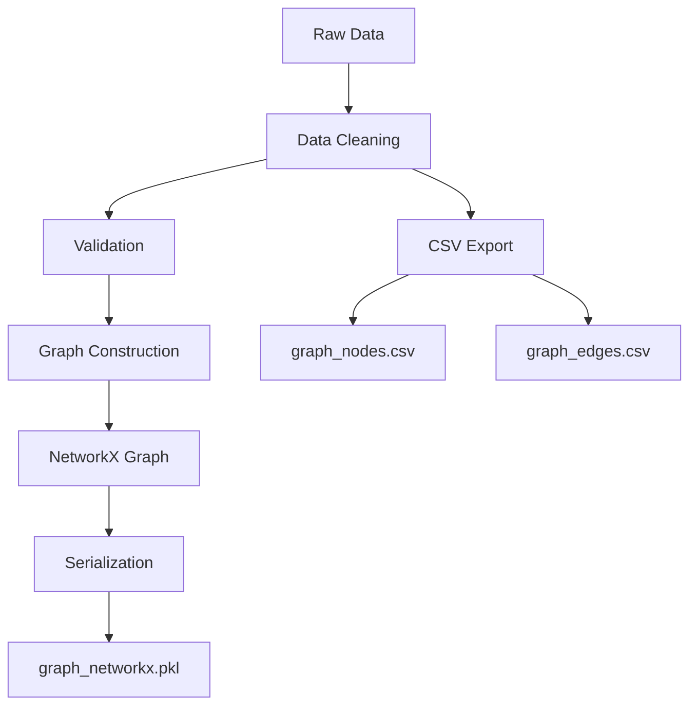
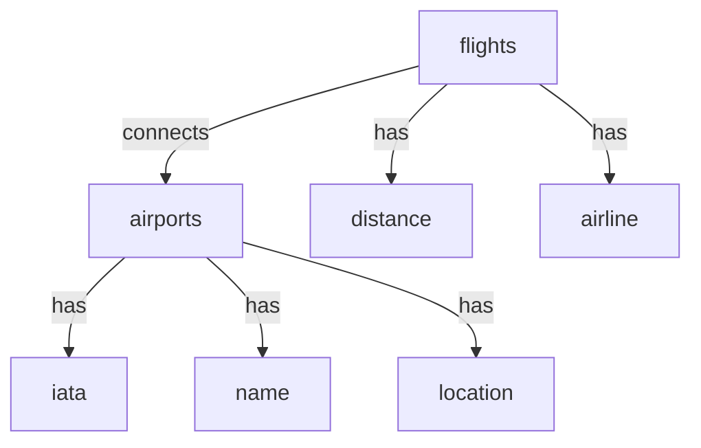
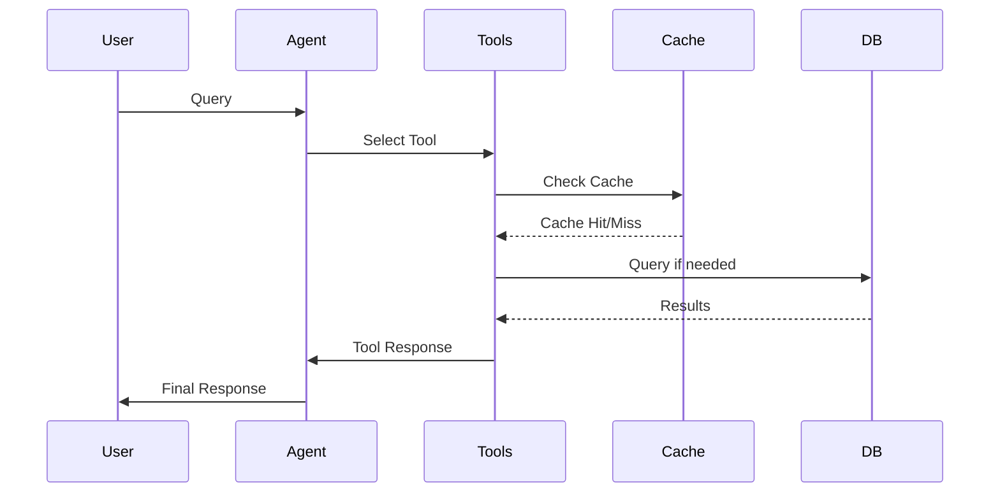

# GraphRAG Agentic Flight Network Analysis System - Development Process

## Table of Contents
1. [Project Structure](#1-project-structure)
2. [Data Collection and Processing](#2-data-collection-and-processing)
3. [Database Setup](#3-database-setup)
4. [Graph Construction](#4-graph-construction)
5. [System Architecture Development](#5-system-architecture-development)
6. [LLM Integration](#6-llm-integration)
7. [Testing and Optimization](#7-testing-and-optimization)
8. [Deployment and Monitoring](#8-deployment-and-monitoring)

## 1. Project Structure

### 1.1 Directory Layout
```
GraphRAG_Agentic_APP/
├── data/                      # Data files directory
│   ├── airports.dat          # Raw airport data from OpenFlights
│   ├── routes.dat           # Raw route data from OpenFlights
│   ├── graph_nodes.csv      # Processed airport nodes data
│   ├── graph_edges.csv      # Processed flight routes data
│   ├── graph_networkx.pkl   # Serialized NetworkX graph
│   └── distance_distribution.png  # Graph visualization
├── scripts/                  # Application scripts
│   ├── agentic_app.py       # Main application file
│   └── verify_data.py       # Data verification utilities
├── docs/                    # Documentation
├── tests/                   # Test files
├── models/                  # Model configuration
├── src/                     # Source code
├── venv/                    # Virtual environment
├── new_env/                 # Additional virtual environment
├── .env                     # Environment variables
├── requirements.txt         # Project dependencies
├── README.md               # Project overview
├── process.md              # Development process (this file)
└── llm_backend.log         # Application logs
```

### 1.2 Key Files Description

#### Data Files
1. **airports.dat**
   - Raw airport data from OpenFlights
   - Contains: Airport ID, Name, City, Country, IATA/ICAO codes, Latitude, Longitude
   - Size: 1.1MB
   - Used for: Initial data import

2. **routes.dat**
   - Raw route data from OpenFlights
   - Contains: Airline, Source airport, Destination airport, Stops, Equipment
   - Size: 2.3MB
   - Used for: Flight route construction

3. **graph_nodes.csv** (264KB, 3259 lines)
   - Processed airport data
   - Contains: IATA code, Name, City, Country, Latitude, Longitude
   - Format: CSV with headers
   - Used for: Quick airport information lookup

4. **graph_edges.csv** (1.7MB)
   - Processed flight route data
   - Contains: Source IATA, Destination IATA, Airline, Distance
   - Format: CSV with headers
   - Used for: Route analysis and path finding

5. **graph_networkx.pkl** (1.5MB)
   - Serialized NetworkX graph object
   - Contains: Complete flight network structure
   - Used for: Fast graph operations and analysis

6. **distance_distribution.png**
   - Visualization of flight distances
   - Shows: Distribution of route lengths
   - Used for: Data analysis and documentation

#### Application Files

1. **agentic_app.py**
   ```python
   # Main components:
   - Config class: Application configuration
   - MetricsCollector: Performance monitoring
   - HealthCheck: System health monitoring
   - ThreadSafeCache: Caching implementation
   - FlightGraphTools: Core graph operations
   - OllamaWrapper: LLM integration
   ```

2. **.env**
   ```env
   ARANGO_HOST=http://localhost:8529
   ARANGO_DB=flights_db
   ARANGO_USER=root
   ARANGO_PASSWORD=your_password
   OLLAMA_MODEL=llama2
   LOG_LEVEL=INFO
   ```

3. **requirements.txt**
   - Core dependencies:
     - networkx, pandas, numpy for data processing
     - torch, transformers for ML operations
     - langchain, langgraph for LLM integration
     - python-arango for database operations
     - fastapi, uvicorn for API (future use)

## 2. Data Collection and Processing

### 2.1 Data Pipeline


### 2.2 Data Processing Steps
```python
# 1. Load and clean raw data
airports_df = pd.read_csv('data/airports.dat', header=None)
routes_df = pd.read_csv('data/routes.dat', header=None)

# 2. Process airports
processed_airports = airports_df[['IATA', 'Name', 'City', 'Country', 'Latitude', 'Longitude']]
processed_airports.to_csv('data/graph_nodes.csv', index=False)

# 3. Process routes
processed_routes = routes_df[['Source Airport', 'Destination Airport', 'Airline']]
processed_routes['Distance'] = calculate_distances(processed_routes)
processed_routes.to_csv('data/graph_edges.csv', index=False)

# 4. Create NetworkX graph
G = create_graph(processed_airports, processed_routes)
nx.write_gpickle(G, 'data/graph_networkx.pkl')
```

## 3. Database Setup

### 3.1 ArangoDB Schema


### 3.2 Database Initialization
```python
# Initialize collections and indexes
db.create_collection('airports')
db.create_collection('flights', edge=True)

# Create indexes for performance
db.airports.add_hash_index(['iata'])
db.airports.add_geo_index(['latitude', 'longitude'])
```

## 4. System Components

### 4.1 FlightGraphTools Class
The core class handling all graph operations:

```python
class FlightGraphTools:
    """
    Core functionality:
    1. Graph operations (path finding, centrality)
    2. Cache management
    3. Data validation
    4. Error handling
    """
    
    def __init__(self):
        self.db = get_arango_db()
        self.G = get_networkx_graph()
        self._precompute_metrics()

    # Key methods:
    - find_direct_flights(airport_code)
    - find_shortest_path(source, target)
    - analyze_airport_importance(airport_code)
    - get_country_connectivity(country)
```

### 4.2 Caching System
```python
class ThreadSafeCache:
    """
    Thread-safe LRU cache implementation:
    - Supports concurrent access
    - Configurable cache size
    - Automatic eviction
    """
```

### 4.3 Metrics Collection
```python
class MetricsCollector:
    """
    Tracks:
    - Query counts
    - Cache performance
    - Response times
    - Error rates
    - Tool usage statistics
    """
```

## 5. LLM Integration

### 5.1 Agent Architecture


### 5.2 Tool Implementation
```python
tool_list = [
    Tool(name="FindDirectFlights",
         func=tools.find_direct_flights,
         description="Find direct flights from airport"),
    Tool(name="FindShortestPath",
         func=tools.find_shortest_path,
         description="Find optimal route between airports"),
    # ... additional tools
]
```

## 6. Testing and Monitoring

### 6.1 Health Checks
```python
class HealthCheck:
    """
    Monitors:
    - Database connectivity
    - LLM availability
    - Graph data integrity
    - Cache performance
    """
```

### 6.2 Performance Metrics
- Query response times
- Cache hit rates
- Memory usage
- Error rates
- Tool usage patterns

## 7. Future Enhancements

### 7.1 Planned Features
1. Real-time flight data integration
2. Advanced visualization dashboard
3. API endpoint expansion
4. Multi-model LLM support
5. Distributed caching

### 7.2 Performance Optimizations
1. Query optimization
2. Cache strategy improvements
3. Database indexing enhancements
4. Parallel processing implementation

## 8. Resources and References
- [OpenFlights Database](https://openflights.org/data.html)
- [ArangoDB Documentation](https://www.arangodb.com/docs)
- [NetworkX Documentation](https://networkx.org/)
- [LangGraph Documentation](https://python.langchain.com/docs/langgraph)
- [Ollama Documentation](https://ollama.ai/docs) 